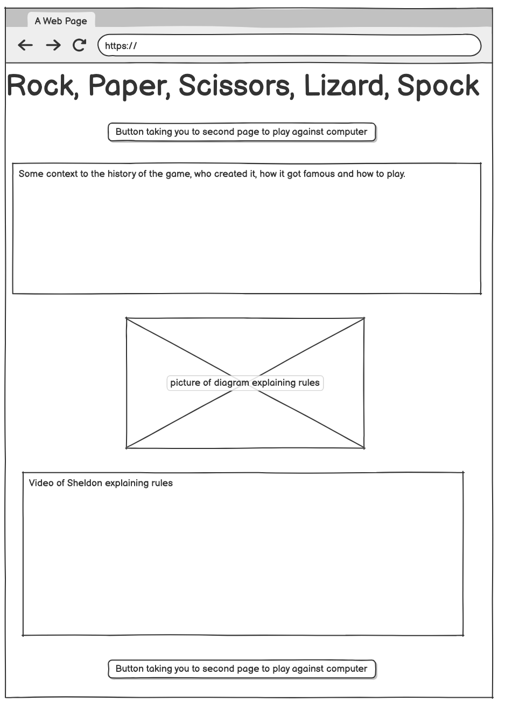
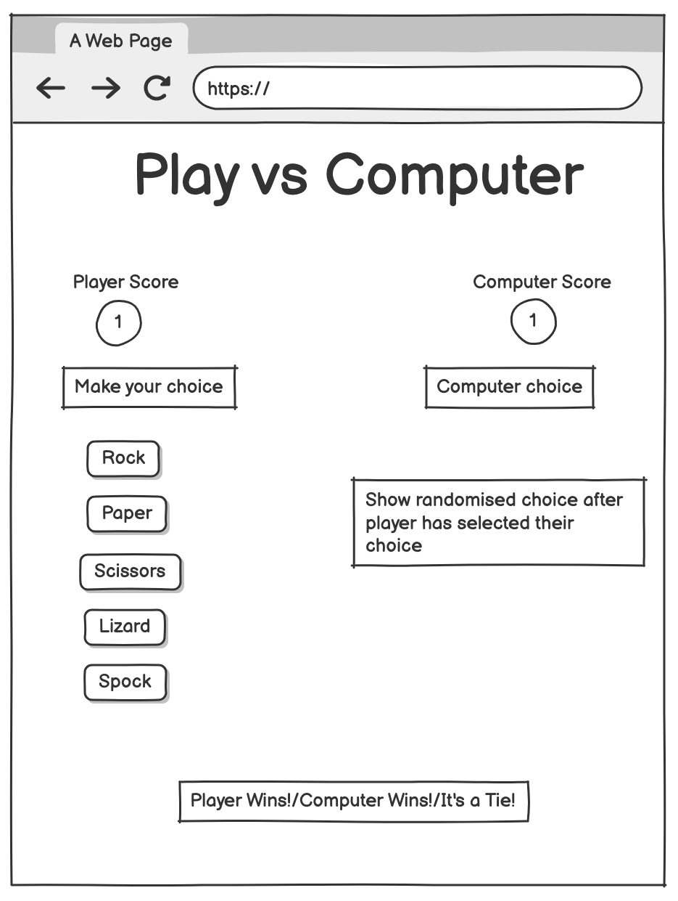
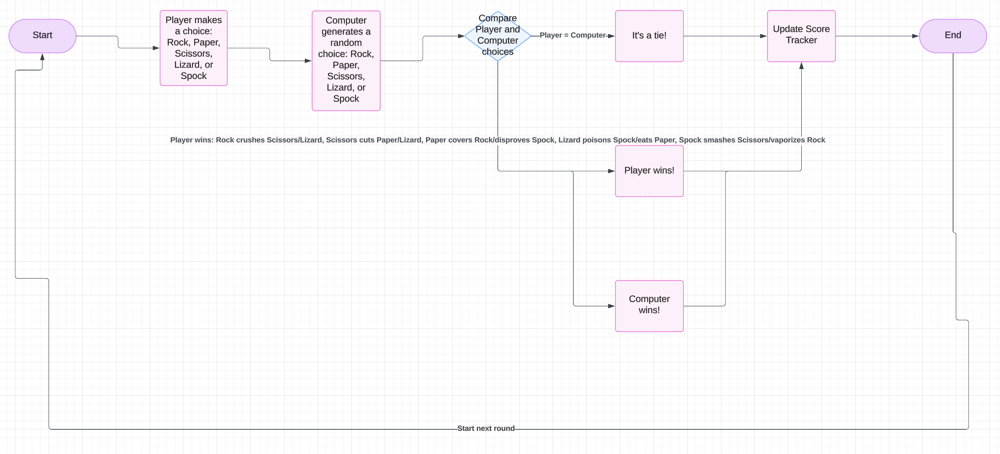
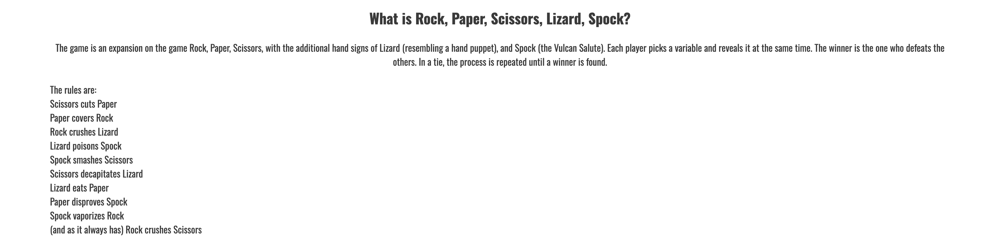
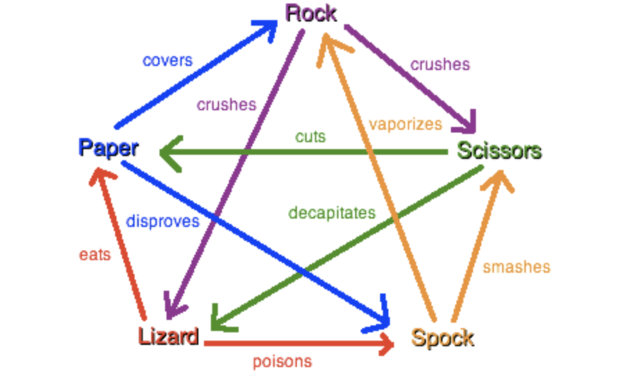
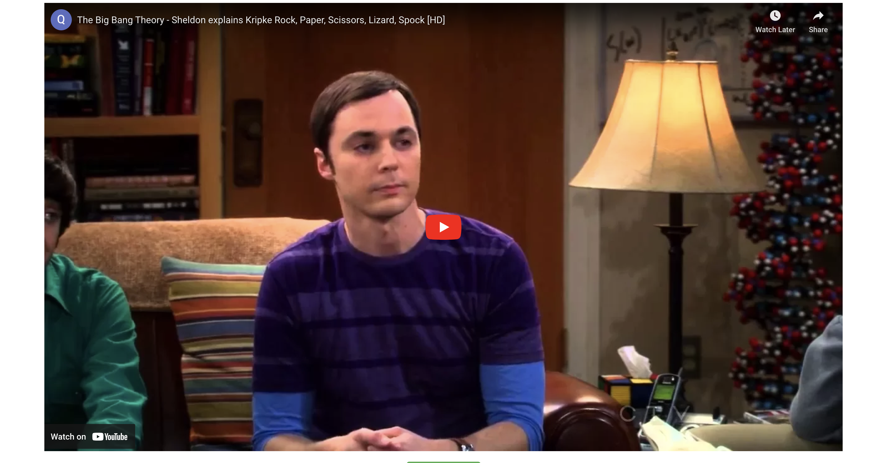
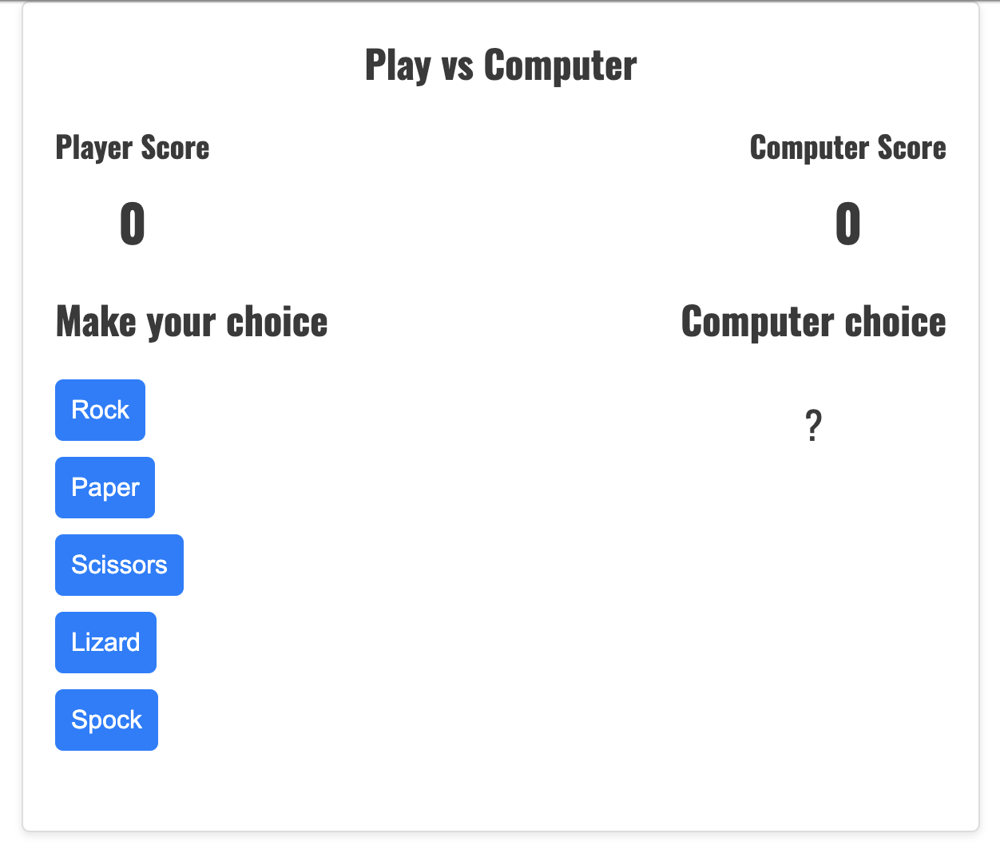

# Rock, Paper, Scissors, Lizard, Spock

My goal with this project was to create a front end site where users can play Rock, Paper, Scissors, Lizard, Spock against a computer with randomised choices. I also wanted to create a Home page to explain the rules clearly to the user.

This site is targeted towards people who are fans of the game Rock, Paper, Scissors and want to try a more complex version of the game. It is also targeted towards fans of the Big Bang Theory TV show who discovered the game through the show and wanted to try it for themselves.

## Planning

### Wireframes

For my planning I created wireframes for my Home and Play pages.

I used the wireframes as a template to help me write the HTML and CSS code for each page.

### Flowchart

I also created a flowchart of how the game will work.

I used this flowchart as a template to help me write the JavaScript for the game.

## Existing Features

### Button to navigate to Play vs Computer page

I added 2 navigation buttons to take you from the Home page to the Play page. I added 1 at the top for people who already know the rules of the game so they can go straight to the Play vs Computer page. I also added 1 at the bottom for the users that scroll through all the content on the page so they can go straight to the Play vs Computer page once they reach the bottom of the page and they don't have to scroll back up to the top.

### Opening Section

In the opening section I explained to the user what the game is and gave them a list of the rules of the game.

### Diagram explaining rules

I added an image of a diagram explaining the rules of the game below the opening section.

### Video of Sheldon from The Big Bang Theory explaining the game

I added this video of Sheldon from The Big Bang Theory explaining the game, as most people who have heard of this game will have heard of it from this TV show. It adds a comedic aspect to my website and I think it will make fans of the show more likely to try the game.

### Play vs Computer page

This is an image of the Play vs Computer page. This is the main feature of my website. I designed my game to follow the rules of Rock, Paper, Scissors, Lizard, Spock and allow the user to play against the computer which generates randomised choices.

I added a score tracker displaying both the Player's and Computer's scores. On the left side is the list of options for the player to choose from. Once the player makes their choice the computer will generate a random choice and it will be displayed on the right side. My JavaScript will then determine the winner and display the result at the bottom. The score tracker will then be updated dependant on the result.

## Testing

## Deployment

## Credit

